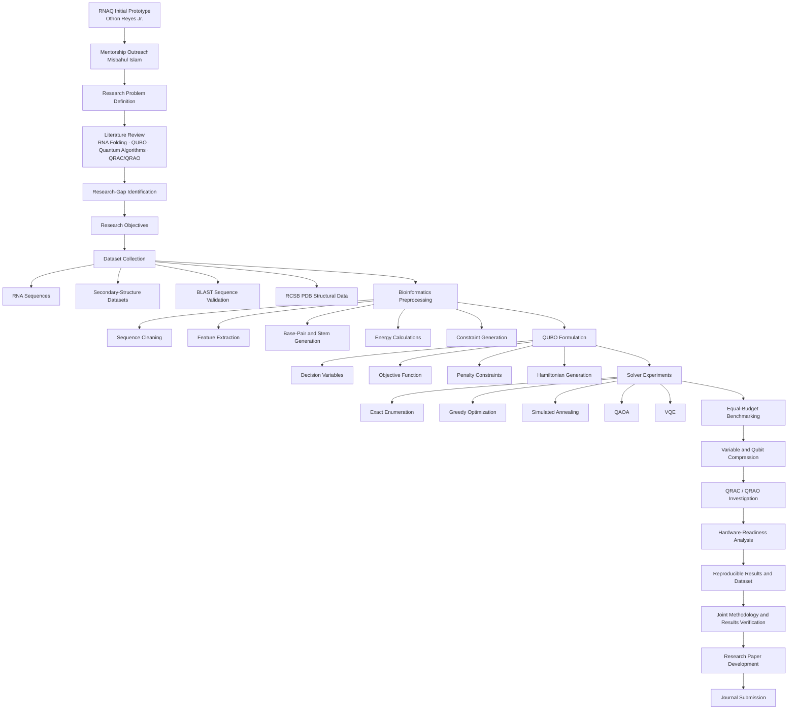
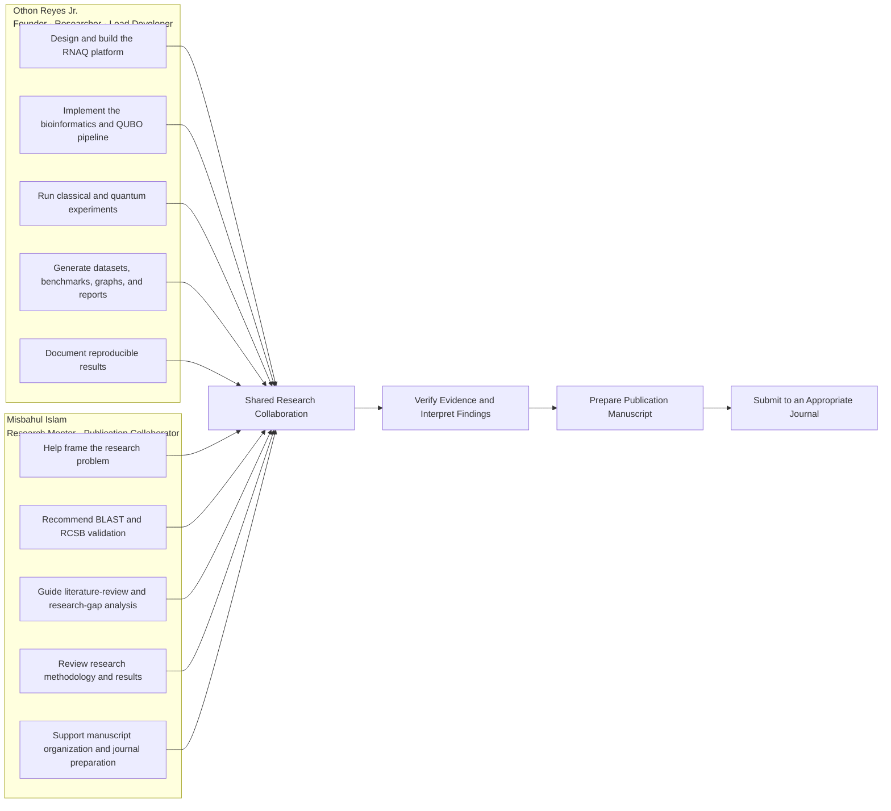

# Research Mentors & Collaborators

## Misbahul Islam

**Website role:** Research Mentor & Publication Collaborator

**Areas of contribution:** Bioinformatics validation, RNA optimization methodology, QUBO research design, quantum benchmarking, and publication planning.

Misbahul Islam reached out during the early development of the RNAQ project and offered research mentorship, methodological guidance, and support toward developing the work into a publication. At the time, Othon Reyes Jr. was beginning his work in quantum computing and computational bioinformatics, and this guidance helped direct the project from an early software prototype toward a structured research study.

He recommended organizing the work around a defined research problem, literature review, research-gap analysis, measurable objectives, dataset development, bioinformatics preprocessing, QUBO formulation, classical and quantum benchmarking, qubit-compression research, and publication-ready validation. He also encouraged the use of BLAST and RCSB PDB resources to strengthen the biological and structural validation process.

The collaboration established a clear division of responsibility: Othon Reyes Jr. continues developing the software, conducting the experiments, and producing the research data, while Misbahul Islam helps review the methodology, verify the results, and support the preparation of a research paper for submission to an appropriate journal.

Othon Reyes Jr. remains grateful to the mentors, researchers, educators, and collaborators who offered their time and knowledge while he was entering this field. Their guidance strengthened the scientific direction of the project while he continued developing his own capabilities as a researcher and software developer.

## Role boundary

This acknowledgment does not identify Misbahul Islam as a co-founder, project owner, principal investigator, or formally appointed faculty adviser. Publication authorship will be determined separately during manuscript development through an explicit contribution and authorship agreement.

## Collaboration pathway

## Role assignment

